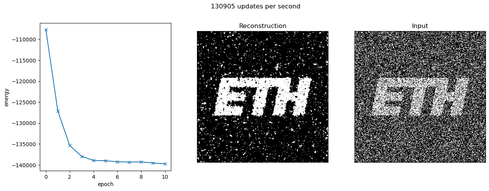
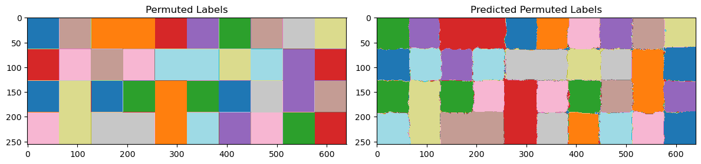
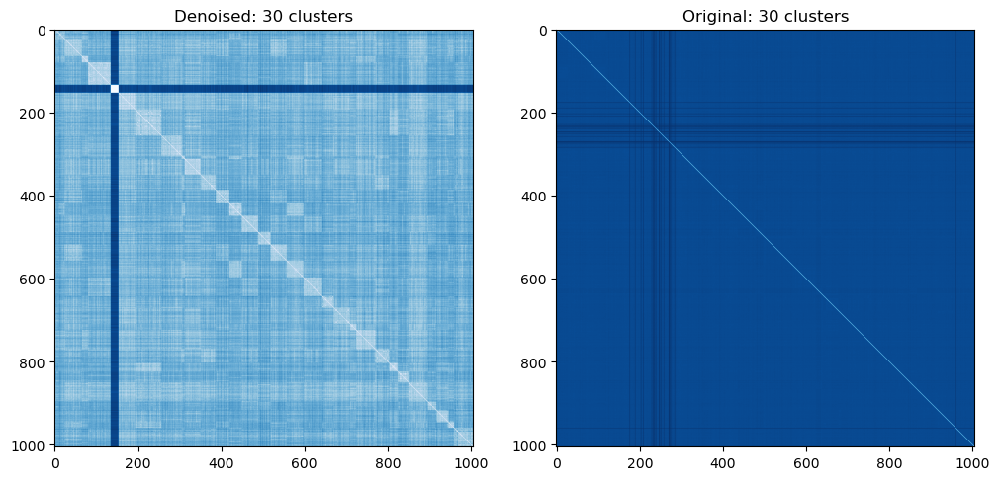

# **Statistical Learning Theory**

# **Markov Chain Monte Carlo Sampling**
We implement different Markov Chain Monte Carlo (MCMC) sampling methods described in [1], which are used to solve the following problems:
- Image reconstruction: denoising a binary image is achieved by minimizing an energy function derived from the Ising model (see [2], Section 8.3.3). Maximum A Posteriori (MAP) inference is used to recover the most likely original image from a noisy input.
- Traveling Salesman Problem: The TSP is solved using MCMC techniques to find the optimal route that minimizes the total distance traveled by a salesman visiting a set of cities exactly once.

# **Histogram Clustering**
We perform image segmentation using Histogram Clustering (HC) as presented in [3]. The cluster membership of each pixel is predicted using two different approaches: Maximum A Posteriori (MAP) probability and Deterministic Annealing (DA). The latter allows to improve the first procedure by avoiding unfavorable local minima.

# **Constant Shift Embedding**
Given a dissimilarity matrix, Constant Shift Embedding (CSE) can be used to find a Euclidean representation of the pairwise relations while preserving the group structure. We implement CSE as introduced in [4] for restating pairwise clustering problems in vector spaces. In particular, we cluster groups of research community members based on the email correspondence matrix (see [5]).

# **References**
[1] [**An Introduction to MCMC for Machine Learning**](http://www.cs.princeton.edu/courses/archive/spr06/cos598C/papers/AndrieuFreitasDoucetJordan2003.pdf)

[2] Bishop, Christopher M. "Pattern Recognition and Machine Learning." (2006).

[3] [**Histogram clustering for unsupervised image segmentation**](http://ieeexplore.ieee.org/document/784981)

[4] [**Optimal cluster preserving embedding of nonmetric proximity data**](https://ieeexplore.ieee.org/document/1251147)

[5] [**email-Eu-core**](https://snap.stanford.edu/data/email-Eu-core.html)
